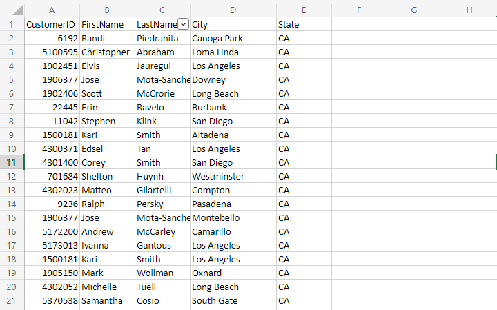
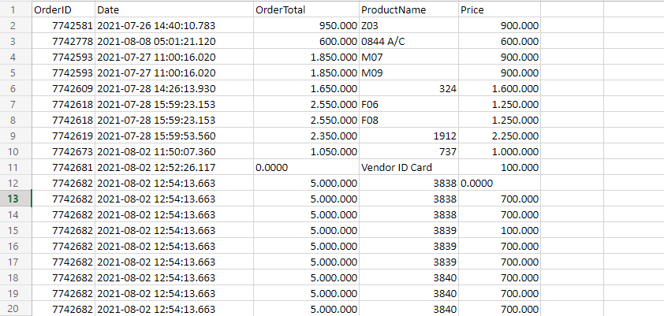

# Challenge - Anyone IA

<div style="text-align: center;">
  <br><br/>
  
  <br><br/>
</div>

Los clientes y los pedidos son el alma de cualquier negocio y está prácticamente garantizado que en un momento u otro de su futuro empleo tendrá que lidiar con situaciones como la que se presenta aquí.

El archivo **customers.csv** tiene 5 columnas ( CustomerId, First Name, Last Name, City and State ). y representa los datos de los clientes.

<div style="text-align: center;">
  <br><br/>
  
  <br><br/>
</div>

El archivo **orders.csv** tiene 6 columnas ( CustomerID, OrderID, Date, OrderTotal, ProductName, Price ). Y representa la contiene los datos de los pedidos de los clientes de customers.csv:

<div style="text-align: center;">
  <br><br/>
  
  <br><br/>
</div>

***

Utilizamos la libreria requets para obtener la data desde el github.

```python
import requests

def import_data_files():
  r = requests.get('https://raw.githubusercontent.com/anyoneai/notebooks/main/customers_and_orders/data/customers.csv')
  with open('./sample_data/customers.csv', 'wb') as f:
    f.write(r.content)

  r = requests.get('https://raw.githubusercontent.com/anyoneai/notebooks/main/customers_and_orders/data/orders.csv')
  with open('./sample_data/orders.csv', 'wb') as f:
    f.write(r.content)
  
import_data_files()
```
***

## **Question #1.1**: How many unique orders are in the orders.csv file?

```python
import pandas as pd

df = pd.read_csv(datafile)
print("Number of Clients on file : ",len(df.index))
```

***Cantidad de clientes unicos en el archivo orders.csv : 602***

***

## **Question #1.2:** In how many different states do the customers live in?


```python
import pandas as pd

df = pd.read_csv(datafile)

def corregir_campo(x):
  x_upper = x.upper()
  characters = " "
  x_upper = ''.join( x for x in x_upper if x not in characters)
  return x_upper

df_state_clear=df['State'].apply(corregir_campo)

state_unique = pd.unique(df_state_clear)

print(state_unique)
print("Cantidad de estados : ",len(state_unique),'\n')
```

***Lista de estados donde viven los clientes : ['CA' 'AZ' 'NV' 'FL' 'WA' 'NH' 'ID' 'CO' 'TX' 'NM' 'OR' 'UT' 'MA' 'IN']***

***Cantidad de estado : 14***

***

## **Question #1.3:** What is the state with most customers?


```python
import pandas as pd

df = pd.read_csv(datafile)

def corregir_campo(x):
  x_upper = x.upper()
  characters = " "
  x_upper = ''.join( x for x in x_upper if x not in characters)
  return x_upper

df_state_clear=df['State'].apply(corregir_campo)

state_maximo = df_state_clear.value_counts().idxmax()

print("Estado con mayoria de clientes : " , state_maximo)
```

***Estado con mayoria de clientes :  CA***

***

## **Question #1.4:** What is the state with the least customers?


```python
import pandas as pd

df = pd.read_csv(datafile)

def corregir_campo(x):
  x_upper = x.upper()
  characters = " "
  x_upper = ''.join( x for x in x_upper if x not in characters)
  return x_upper

df_state_clear=df['State'].apply(corregir_campo)

state_counts = df_state_clear.value_counts()

state_min= state_counts[ state_counts == state_counts.min() ]


print( "Estado con menos clientes : " , list(state_min.index) )
```

***Estado con menos clientes :  ['WA', 'NH', 'ID', 'OR', 'MA', 'IN']***

***

## **Question #1.5:** What is the most common last name?


```python
import pandas as pd

df = pd.read_csv(datafile)

LastName_unique = df['LastName'].map(lambda x:x.upper())
LastName_max = LastName_unique.value_counts().idxmax()

print( "Apellido mas comun : ", LastName_max )
```

***Apellido mas comun :  SMITH***

***

## **Question #2.1:** How many unique orders are in the orders.csv file?

```python
import pandas as pd

df = pd.read_csv(datafile)

df_OrderID_unique = pd.unique(df['OrderID'])

print("Pedidos unicos : ",len(df_OrderID_unique))
```
***Pedidos unicos :  16672***

***

## **Question #2.2:** What is the average number of items per order (rounded to two decimal places)?

```python
import pandas as pd

df = pd.read_csv(datafile)

OrderID_count = df['OrderID'].value_counts()

print("Valor promedio pedidos por OrdenID : ",round( OrderID_count.mean(),2) )
```

***Valor promedio pedidos por OrdenID :  1.76***

***

## Question #2.3: What is the highest number of items per order?

```python
import pandas as pd

df = pd.read_csv(datafile)

OrderID_count = df['OrderID'].value_counts()
print("Mayor número de Items por pedido : ",OrderID_count.max())
```

***Mayor número de Items por pedido :  35***

***

## Question #2.4: What is the number of orders placed in October 2021?

```python
import pandas as pd

df = pd.read_csv(datafile)

df_dropna = df.dropna()

mask = (df_dropna['Date'] > '2021-10-01') & (df_dropna['Date'] <= '2021-10-31')
filtered_df=df_dropna.loc[mask]
print("Numero de ordenes atendidas en octubre 2021 : ",len(filtered_df))
```

***Numero de ordenes atendidas en octubre 2021 :  437***

***

## Question #2.5: Which customer spent the most amount of money in 2021?

```python
import pandas as pd

df = pd.read_csv(datafile)

df_dropna = df.dropna()

mask = (df_dropna['Date'] > '2021-01-01') & (df_dropna['Date'] <= '2021-12-31')
filtered_df=df_dropna.loc[mask]

CustomerID_counts = filtered_df['CustomerID'].value_counts()

list_CustomerID = list(CustomerID_counts.index)

list_Price = []

for i in list_CustomerID:
  Price = filtered_df['Price'][ filtered_df['CustomerID'] == i ].sum()
  list_Price.append(Price)


price_max = pd.Series( list_Price , index = list_CustomerID ).max()
CustomerID_price_max = pd.Series( list_Price , index = list_CustomerID ).idxmax()


df_customers = pd.read_csv("./sample_data/customers.csv")


FirstName_price_max = list( df_customers['FirstName'][ df_customers['CustomerID'] == CustomerID_price_max ] )[0] 
LastName_price_max = list( df_customers['LastName'][ df_customers['CustomerID'] == CustomerID_price_max ] )[0]

print( FirstName_price_max + " " + LastName_price_max + " , CustomerID : "+ str(CustomerID_price_max) + " has spent $" + str(price_max) )
```

***Brandon Divas , CustomerID : 5172443 has spent $7675.0***

***

## Question #2.6: Historically, what is the best month for sales?

```python
import pandas as pd

df = pd.read_csv(datafile)

df_dropna = df.dropna()

df_dropna['month'] = pd.DatetimeIndex(df_dropna['Date']).month

sum_mensual = []

meses = ['enero' ,'febrero','marzo','abril','mayo','junio','julio','agosto','septiembre','octubre','noviembre','diciembre']


for i in range(len(meses)):
  sum_mensual.append( df_dropna['Price'][ df_dropna['month'] == i+1 ].sum() )

price_max = pd.Series( sum_mensual , index = meses )

print("Historicamente , el mes con mas ingresos es : ",price_max.idxmax(),'\n')
```

***Historicamente , el mes con mas ingresos es :  enero***

***